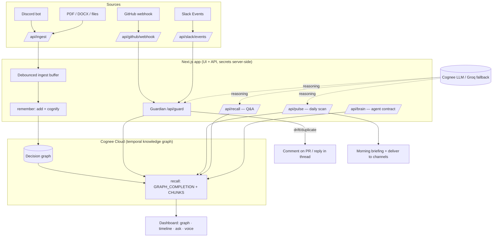
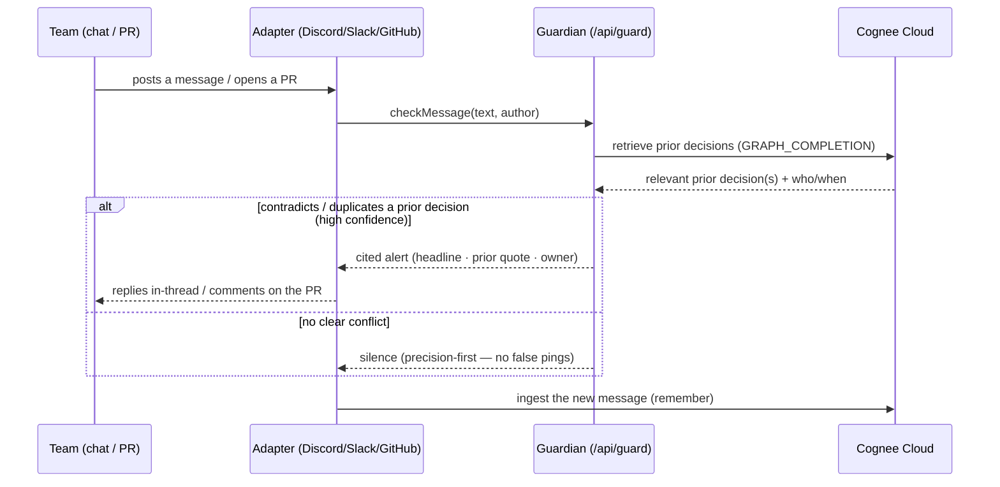

<div align="center">
  
  <h3>Catch what your team forgot it decided.</h3>
  <p>A proactive AI agent that watches your team's chat, PRs and docs — and speaks up the moment a decision contradicts one you already made, two teams build the same thing, or knowledge is about to walk out the door.</p>
  <p><em>Organizational memory, powered by <a href="https://www.cognee.ai">Cognee Cloud</a>.</em></p>
</div>

---

## The problem

Decisions get made in Slack, standups, and PRs — then quietly forgotten. People ship things the team already ruled out, two squads build the same service unaware of each other, and when one person leaves, the "why" leaves with them. None of this is a **search** problem ("where's the doc?"). It's a **memory** problem: the org can't remember *what it decided, when, and why* — and can't notice when it contradicts itself.

**Trace is not a search box you query. It's an agent that watches and interrupts only when it matters.**

## What it catches

| Finding | Example |
|---|---|
| 🔴 **Decision drift** | A PR moves billing to MongoDB — but the team standardized on Postgres last quarter. |
| 🔵 **Duplicate work** | Payments and Platform each build a retry queue, in different channels, unaware. |
| 🟡 **Ownership / bus-factor gaps** | Auth is solely owned by one engineer who's going on leave. |

Every finding is **cited, dated, and owned** — and you grade it (✓ real / ✕ not real), which trains the agent's precision for *your* team.

---

## Architecture

Trace is a single Next.js process that serves the UI **and** hosts all API routes (every secret stays server-side). Chat platforms push events through thin adapters into ingest endpoints; a debounced buffer batches writes into **Cognee Cloud**, which is the system's temporal knowledge graph — the brain. All reasoning (drift/duplicate/ownership) is grounded in that graph.



### How Cognee Cloud powers it (the memory lifecycle)

Trace uses the full Cognee lifecycle — it's the brain, not a bolt-on:

- **remember** — every message / PR / doc → `add` then `cognify` builds an evolving graph of entities and **typed, temporal relationships** (who · decided · because · **supersedes**). A *graph*, not vector chunks, is what makes "this decision reversed that one over time" representable at all.
- **recall** — `search` with `GRAPH_COMPLETION` (traverses the subgraph and composes an answer) and `CHUNKS` (the exact source message, for citations). The graph endpoint drives the live visualization.
- **improve** — graded findings are written back into memory as notes, and re-`cognify` supersedes stale decisions — the memory self-corrects instead of only appending.
- **forget** — redaction across every surface (graph, answers, findings) for confidential items.

The client (`lib/cognee.ts`) authenticates to Cognee Cloud with `X-Api-Key` + `X-Tenant-Id`, and hardens every call with per-request timeouts, a fresh-socket retry for transient resets, and a circuit breaker.

---

## The agentic workflow

Trace runs a continuous **Observe → Remember → Detect → Interrupt → Learn** loop. It doesn't wait to be prompted.



**Precision is the whole game.** A false "you contradicted yourself" ping destroys trust, so the Guardian only fires on a genuine, high-confidence conflict it can cite. Silence is correct most of the time. The **confirm/dismiss feedback loop** is the moat: nobody grades a search result, but everybody grades a push notification — that graded corpus is data a pull product can't collect.

Three cadences run on top of the same memory:
- **Guardian (real-time)** — per message/PR drift & duplicate checks (above).
- **Briefing (daily)** — a scan that surfaces the top "N things your team forgot," deliverable to Discord/Slack/Teams in one click.
- **Deep-dive (on demand)** — Ask (text/voice), the decision **Timeline** (temporal supersession, visualized), What-if (bus-factor projection), and the **Company Brain API** (`/api/brain`) — a machine-readable contract other agents can query before they act.

---

## Tech stack

- **App** — Next.js 14 (App Router) · React 18 · TypeScript (strict) · Tailwind (OKLCH design tokens)
- **Memory** — **Cognee Cloud** (temporal knowledge graph; `remember` / `recall` / `improve` / `forget`)
- **Reasoning** — Cognee's managed LLM (primary) with a Groq fallback for the drift Guardian & answer composition
- **Graph viz** — `react-force-graph-2d`
- **Voice** — ElevenLabs Conversational AI (WebRTC), lip-synced avatar
- **Sources** — Discord (`discord.js` gateway) · GitHub (HMAC-verified webhooks) · Slack (Events API) · Teams (incoming webhook) · file upload (PDF/DOCX/XLSX/CSV)
- **Tests/CI** — Vitest · GitHub Actions (typecheck · lint · test · build · gitleaks secret scan)

## Project structure

```
app/            Next.js routes — pages + ~20 API handlers (ingest, guard, recall, pulse, brain, webhooks…)
components/     UI — dashboard, decision graph, timeline, ask/voice, briefing, integrations hub
lib/            Domain services — cognee client + failover, guard, pulse, compose, whatif, integrations, notify
adapters/       Chat-platform bridges — discord-bot.mjs, teams/
data/           Demo dataset (decision ledger + sample meetings + mock graph)
```

## Getting started

```bash
# 1. install
npm install

# 2. configure Cognee Cloud (copy the template, fill in real values)
cp .env.example .env.local
#   COGNEE_ENABLED=true
#   COGNEE_BASE_URL=https://<your-tenant>.cognee.ai
#   COGNEE_API_KEY=...            COGNEE_TENANT_ID=...
#   COGNEE_DATASET=trace
#   GROQ_API_KEY=...              (fallback reasoning + stateless baseline)
#   NEXT_PUBLIC_ELEVENLABS_AGENT_ID=...   (optional, voice)

# 3. run
npm run dev            # http://localhost:3001
npm run seed:demo      # (optional) load the sample decision history
```

Connect sources from the in-app **Sources** page (Discord/GitHub/Slack/Teams) — no terminal needed. Health at `GET /api/health`.

## Key API surface

| Endpoint | Purpose |
|---|---|
| `POST /api/ingest` | Chat/file adapters push messages → buffered into Cognee |
| `POST /api/guard` | Real-time drift/duplicate check for one message |
| `POST /api/recall` | Cited Q&A over team memory (text + voice) |
| `GET  /api/pulse` | Daily briefing — the top findings, each cited |
| `GET  /api/brain?q=` | **Company Brain** — structured, agent-consumable answer (status-aware) |
| `POST /api/github/webhook` | HMAC-verified PR drift catch → comments on the PR |
| `GET  /api/health` | Liveness + Cognee reachability |

---

<div align="center">
  <sub>Built for the Cognee × WeMakeDevs hackathon · runs on Cognee Cloud.</sub>
</div>
