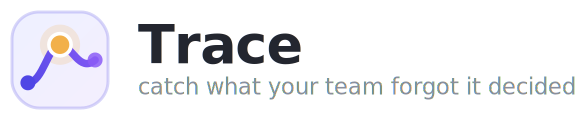
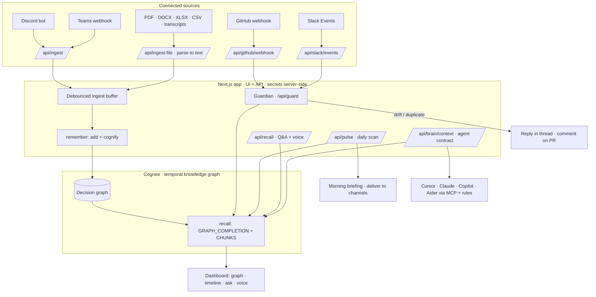
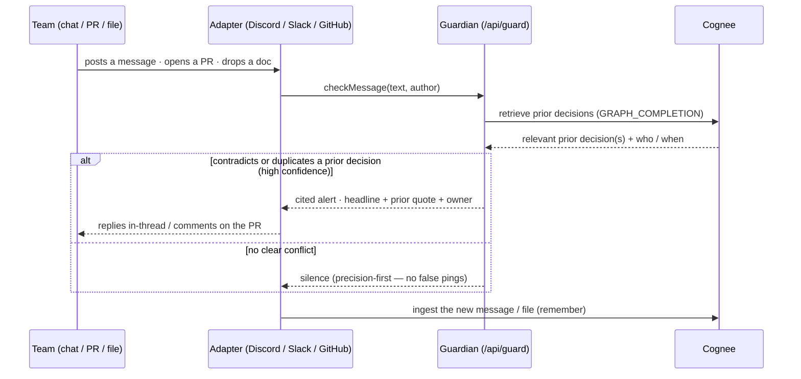

<div align="center">
  

  <h3>The organizational memory that remembers <em>for</em> you — and speaks up when your team forgets.</h3>

  <p>
    Trace watches your team's chat, pull requests, and documents across every platform,
    builds a living <strong>temporal knowledge graph</strong> of every decision, and
    interrupts the moment someone contradicts a past decision, rebuilds something that
    already exists, or lets critical knowledge walk out the door.
  </p>

  <p>
    <a href="https://trace-oix4.onrender.com/"></a>
    <a href="https://youtu.be/wUpaymjsmaw"></a>
  </p>

  <p>
    
    
    
    
    
  </p>

  <p>
    <a href="https://trace-oix4.onrender.com/">🌐 Website</a> ·
    <a href="https://youtu.be/wUpaymjsmaw">▶️ Demo Video</a> ·
    <a href="#quickstart">🚀 Quickstart</a> ·
    <a href="#company-brain--api-for-agents">🧠 Brain API</a>
  </p>
</div>

---

## Why Trace exists

Decisions get made in Slack threads, standups, PR descriptions, and one-off docs — then quietly forgotten. Engineers ship things the team already ruled out. Two squads build the same service, unaware of each other. When one person leaves, the *why* leaves with them.

None of this is a **search** problem — "where's the doc?" You don't know you need to search, because you don't know the decision exists. It's a **memory** problem: an organization can't remember *what it decided, when, and why* — and can't notice when it contradicts itself.

> **Trace is not a search box you have to remember to open. It's an agent that watches, remembers, and interrupts — only when it matters.**

---

## What Trace catches

| | Finding | Real example it fires on |
|---|---|---|
| 🔴 | **Decision drift** | A PR migrates billing to MongoDB — but the team standardized on PostgreSQL last quarter, "no MongoDB for new services." |
| 🔵 | **Duplicate work** | Payments starts building a retry queue — Platform already shipped a shared one every service was told to reuse. |
| 🟡 | **Ownership / bus-factor gaps** | Auth is solely owned by one engineer — who just announced they're on leave next month. |

Every finding is **cited, dated, and routed to an owner**. You grade it (✅ real / ❌ not real), and that judgment trains the agent's precision for *your* team — a feedback signal a passive search tool never gets to collect.

---

## Core features

### 🛡️ The Guardian — real-time decision defense
The heart of Trace. Every message and PR is checked against the team's entire decision history *before* it lands. When it genuinely contradicts or duplicates a prior decision, Trace replies **in-thread / on the PR** with a cited, high-confidence alert — the headline, the exact prior quote, who decided it, and the reconciliation ask. When there's no real conflict, it stays silent. **Precision is the whole product**: one false "you contradicted yourself" ping destroys trust, so the Guardian only speaks when it can prove it.

### 🌅 The Morning Briefing — proactive discovery
A daily scan over the whole memory that surfaces *the top things your team hasn't realized yet* — drift, duplicate work, and ownership risk — each grounded in real, dated source quotes. One click **delivers the briefing to Discord, Slack, or Teams**. Nobody has to ask; the memory reports on itself.

### 📎 Read the room — files, everywhere
Trace's agents don't just read chat text — **they read the files people drop, on every connected platform.** Attach a PDF spec in Discord, a design doc in Slack, a spreadsheet of decisions, a meeting transcript (`.vtt`/`.srt`) — Trace extracts the text (**PDF, DOCX, XLSX, CSV, Markdown, TXT, transcripts, logs, JSON**), folds it into the same knowledge graph, and reasons over it alongside every message. The result: **richer context and durable long-term memory** — the decisions buried in attachments become first-class, searchable, and defended just like the ones typed in chat.

### 🧠 The Company Brain — memory for *other* agents
Trace exposes the team's live memory as a **machine-readable contract** other coding agents consult *before* they write code. Cursor, Claude Code, Copilot, Aider, and Windsurf can pull architecture constraints, conventions, past mistakes, rejected designs, known bugs, and current ownership — so every agent shares one organizational memory and stops reintroducing things the team already ruled out. Delivered three ways: a live **HTTP endpoint**, a **Model Context Protocol (MCP) server**, and a **rules-file generator** (`.cursorrules`, `CLAUDE.md`, `AGENTS.md`, `.github/copilot-instructions.md`, `CONVENTIONS.md`).

### 🕸️ Live decision graph & timeline
The memory, made visible. An interactive force-directed graph of people, decisions, reasons, and their **typed temporal relationships** (`who · decided · because · supersedes`), plus a decision **timeline** that shows exactly which decision reversed which, and when.

### 💬 Ask — in text or voice
Ask the memory anything ("what did we decide about the database?", "who owns auth?") and get a **cited** answer composed from the graph and the original source messages — in text, or spoken through a lip-synced **voice agent**.

### 🔁 The confirmation loop — a memory that self-corrects
Confirm or dismiss any finding and Trace writes it back into memory: confirmed findings are reinforced, dismissed ones are suppressed and never raised again, and reversed decisions **supersede** the stale ones rather than piling up. The precision score climbs as the team trains it.

### 🔮 What-if & ownership projection
Model a bus-factor scenario ("what happens if this owner leaves?") and see which decisions and systems are exposed.

### 🙈 Forget — first-class redaction
Confidential or forgotten items are redacted across **every** surface — the graph, answers, briefings, and the Brain API — so private context never leaks into an agent's response.

---

## How Cognee powers Trace

Trace is built on **[Cognee](https://www.cognee.ai)** — Cognee is the brain, not a bolt-on. Where a vector store only remembers *text that looks similar*, Cognee's ECL (**Extract → Cognify → Load**) pipeline builds a **temporal knowledge graph** of typed entities and relationships — which is the only representation in which *"this decision reversed that one, over time"* is even expressible. That single capability is what makes drift detection possible.

Trace uses the full Cognee lifecycle:

| Stage | What Trace does | Cognee primitives |
|---|---|---|
| **Remember** | Every message, PR, and parsed file is ingested and turned into an evolving graph of entities and **typed, temporal relationships** (`who · decided · because · supersedes`). | `add()` → `cognify()` |
| **Recall** | Drift checks, Q&A, briefings, and the Brain all retrieve grounded evidence — the traversed subgraph *and* the exact source message for citations. | `search()` with `GRAPH_COMPLETION` + `CHUNKS` |
| **Improve** | Graded findings are written back as notes and re-cognified; reversed decisions supersede the stale ones. | re-`cognify()` on feedback |
| **Forget** | Confidential items are deleted/redacted across every surface. | dataset + node redaction |

The client in [`lib/cognee.ts`](./lib/cognee.ts) authenticates with `X-Api-Key` + `X-Tenant-Id` and hardens every call with per-request timeouts, a fresh-socket retry for transient resets, and a **circuit breaker with automatic failover** to a self-hosted Cognee instance — so a slow or unreachable backend never takes the product down. Retrieval merges **local-embedded chunks + the graph**, so answers stay accurate and cited even under load.

---

## Architecture

Trace is a single Next.js process that serves the UI **and** hosts every API route — all secrets stay server-side. Thin platform adapters push events into ingest endpoints; a debounced buffer batches writes into Cognee, the system's temporal knowledge graph. All reasoning (drift / duplicate / ownership) is grounded in that graph.



### The agentic loop

Trace runs a continuous **Observe → Remember → Detect → Interrupt → Learn** loop. It doesn't wait to be prompted.



---

## Company Brain — API for agents

`GET /api/brain/context?topic=<area>&format=json|md|rules&target=cursor|claude|copilot|aider|agents`

Returns the pre-code context pack — architecture constraints, conventions, past mistakes, rejected designs, known bugs (seeded + memory-derived + live open GitHub issues), and current ownership — scoped to a topic, and always redacted for forgotten/confidential terms.

```bash
# Live JSON an agent can consume before writing code
curl "https://trace-oix4.onrender.com/api/brain/context?topic=database"

# Generate rules files the whole team's agents share
npm run brain:rules      # writes .cursorrules · CLAUDE.md · AGENTS.md · copilot-instructions.md · CONVENTIONS.md
```

**MCP server** ([`adapters/brain-mcp.mjs`](./adapters/brain-mcp.mjs)) exposes two tools to any MCP-capable agent:
- `company_brain({ topic })` → the context pack as agent-readable markdown.
- `check_before_coding({ intent })` → scoped pack **+ conflict flags** ("your plan uses MongoDB — the org standard is Postgres; MongoDB was rejected in Q1").

---

## Tech stack

- **App** — Next.js 14 (App Router) · React 18 · TypeScript (strict) · Tailwind with OKLCH design tokens
- **Memory** — **Cognee** temporal knowledge graph (`remember` / `recall` / `improve` / `forget`), managed or self-hosted, with automatic failover
- **Reasoning** — Cognee's managed LLM for graph completion, with a resilient provider chain (Groq / Google / local Ollama) for the Guardian, briefing, and answer composition — so a single provider's rate limit never breaks the agent
- **File understanding** — `unpdf` (PDF) · `mammoth` (DOCX) · `xlsx` (Excel/CSV) · native text/transcripts
- **Graph viz** — `react-force-graph-2d`
- **Voice** — ElevenLabs Conversational AI (WebRTC) with a lip-synced avatar
- **Sources** — Discord (`discord.js` gateway) · Slack (Events API) · GitHub (HMAC-verified webhooks) · Teams (incoming webhook) · direct file upload
- **Agent interop** — Model Context Protocol server + rules-file generator
- **Quality** — Vitest · CI (typecheck · lint · test · build · secret scan)

## Key API surface

| Endpoint | Purpose |
|---|---|
| `POST /api/ingest` | Chat/platform adapters push messages → buffered into memory |
| `POST /api/ingest-file` | Parse PDF/DOCX/XLSX/CSV/transcripts → text → memory |
| `POST /api/guard` | Real-time drift/duplicate check for one message or PR |
| `POST /api/recall` | Cited Q&A over team memory (text + voice) |
| `GET  /api/pulse` | Morning briefing — the top findings, each cited |
| `GET  /api/brain/context` | **Company Brain** — agent-consumable context pack |
| `POST /api/github/webhook` | HMAC-verified PR drift catch → comments on the PR |
| `POST /api/slack/events` | Slack mentions (answers) + messages (drift), replied in-thread |
| `GET  /api/graph` | The live decision graph for visualization |
| `GET  /api/health` | Liveness + memory backend reachability |

## Project structure

```
app/            Next.js routes — pages + ~25 API handlers (ingest, guard, recall, pulse, brain, webhooks…)
components/     UI — dashboard, decision graph, timeline, ask/voice, briefing, integrations hub
lib/            Domain services — cognee client + failover, guard, pulse, compose, brain, parseFile, notify
adapters/       Platform bridges — discord-bot.mjs, brain-mcp.mjs (MCP), teams/
data/           Decision ledger, known issues, and the offline memory snapshot
scripts/        Seeding + rules-file generation
```

---

## Quickstart

```bash
# 1 · install
npm install

# 2 · configure memory (copy the template, fill in real values)
cp .env.example .env.local
#   COGNEE_ENABLED=true
#   COGNEE_BASE_URL=https://<your-tenant>.cognee.ai   # or http://localhost:8000 (self-hosted)
#   COGNEE_API_KEY=...              COGNEE_TENANT_ID=...
#   COGNEE_DATASET=trace
#   GROQ_API_KEY=...                                   # resilient reasoning fallback
#   NEXT_PUBLIC_ELEVENLABS_AGENT_ID=...                # optional · voice

# 3 · run
npm run dev            # http://localhost:3001
npm run seed:demo      # optional · load a sample decision history to explore
```

Connect Discord, Slack, GitHub, and Teams from the in-app **Sources** page — no terminal required. Health is at `GET /api/health`.

---

<div align="center">
  <br />
  <a href="https://trace-oix4.onrender.com/"><strong>🌐 Try Trace</strong></a> &nbsp;·&nbsp;
  <a href="https://youtu.be/wUpaymjsmaw"><strong>▶️ Watch the 3-min demo</strong></a>
  <br /><br />
  <sub><strong>Trace</strong> — because the most expensive bugs are the decisions your team already made, and forgot.</sub>
</div>
